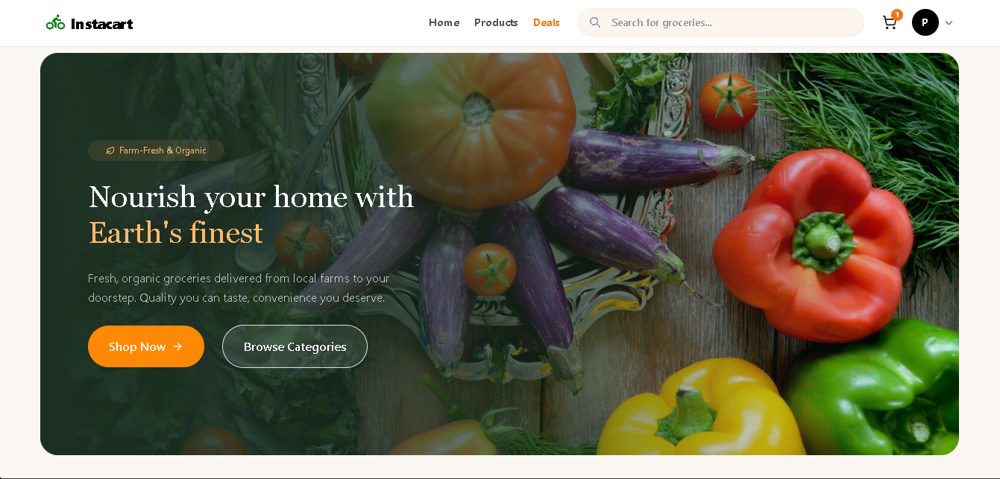
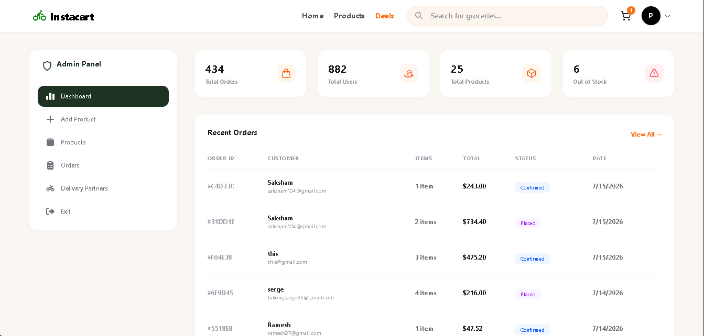

# FreshCart — E-Commerce Grocery Web App

A full-featured grocery e-commerce platform with a customer storefront and a complete admin panel — built on the MERN stack.

🔗 **Live Demo:** [my-grocery-app-six.vercel.app](https://my-grocery-app-six.vercel.app/)

> **Note:** The live app's UI currently displays the brand name "Instacart," which belongs to a real company. This project is a UI/practice clone built for learning purposes and isn't affiliated with or endorsed by Instacart.

## Overview

FreshCart lets customers browse groceries by category, filter by price, view detailed product pages with reviews, and check out through a multi-step flow (address → payment → review). It also includes a full admin panel for managing products, orders, and delivery partners.

## Tech Stack

- **Frontend:** React.js, Tailwind CSS, Bootstrap
- **Backend:** Node.js, Express.js
- **Database:** MongoDB
- **API:** RESTful APIs (custom-built)
- **Tools:** Git, Postman

## Features

**Customer-facing**
- Dynamic product listings with category and price-range filtering
- Product detail pages with stock status and quantity selector
- Customer reviews with a star-rating breakdown
- Related products suggestions
- Flash Deals / promotions page
- Shopping cart with a 3-step checkout (Address, Payment, Review)
- Responsive UI across mobile, tablet, and desktop

**Admin panel**
- Dashboard with live stats (total orders, users, products, low-stock alerts)
- Add / edit / remove products, including image upload
- Order management with status tracking (Placed, Confirmed, Packed, Delivered)
- Delivery partner management (add/deactivate partners)

## Getting Started

> Adjust the commands below if your folder structure (client/server) or scripts differ.

```bash
# 1. Clone the repository
git clone https://github.com/amrmohamed125/my-grocery-app.git
cd my-grocery-app

# 2. Install dependencies
npm install
# if the client and server live in separate folders:
cd client && npm install
cd ../server && npm install

# 3. Set up environment variables
# create a .env file in the server folder with, e.g.:
# MONGODB_URI=your_mongodb_connection_string
# PORT=5000
# JWT_SECRET=your_secret_key

# 4. Run the app
npm start
# or, if client/server are separate:
# in /server: npm start
# in /client: npm start
```

## Screenshots




## Author

**Amr Mohamed**
[LinkedIn](https://www.linkedin.com/in/amrmohamed125/) · [Instagram](https://www.instagram.com/amr_m0hamed1) · [Portfolio](https://portfolio-nine-rouge-82.vercel.app/)
